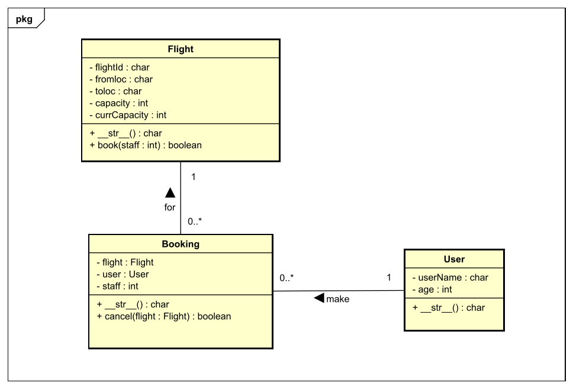

# Simulation d'un Système de Réservation de Vols
## Documentation
# Sommaire

1. [Les Classes](#les-classes)
   - 1.1. [La classe Flight](##la-class-flight)
   - 1.2. [La classe User](#classuser)
2. [Le fichier csv_module.py](#fichiermodulepy)
   - 2.1. [Les méthodes `flight_csv_read()` et `booking_csv_read()`](#methfcrbcr)
   - 2.2 [Les méthodes `flight_csv_save()` et `booking_csv_save()`](#methfcsbcs)
3. [Le fichier main.py](#fichiermainpy)
4. [Les tests Unitaires](#testunitaires)


## 1. Les Classes
Voici le diagramme de classe pour les modèles :



### 1.1 La classe Flight

La classe ```Flights``` correspond au vols.

- Les attributs sont ```flightid``` : référence de vol, ```fromloc``` : départ), ```toloc``` : destination, ```capacity``` : nombre total de place pour le vol, ```currCapacity``` : nombre de place disponible .

```python
class Flight:
    def __init__(self, flightid, fromloc, toloc, capacity, currCapacity):
        self.flightid = flightid
        self.fromloc = fromloc
        self.toloc = toloc
        self.capacity = capacity
        self.currCapacity = currCapacity
```
- La méthode ```__str__(self)``` permet l'affichage de l'objet ```Flight``` en chaîne de caractères avec ```print(flightObject)``` où ````flightObject````est un objet instancié par la classe ```Flight```

```python
    def __str__(self):
        return f"{self.flightid} ({self.fromloc} - {self.toloc}) - {self.capacity} ({self.currCapacity} restants)"
```
- La méthode ```book(self, staff)``` est utilisée pour la réservation de vol. Elle permet de vérifier si le nombre de siège(s) reservé par l'utilisateur (```staff```) ne dépasse pas le nombre de place disponible pour le vol (```self.currCapacity```)`. Après la vérification, la méthode va soustraire ```currCapacity```(nombre de places disponibles) par ```staff```(nombre de sièges reservés) et la méthode retournera ```True``` ou sinon elle retournera ```False```.
```Python
    def book(self, staff):
        if staff <= self.currCapacity:
            self.currCapacity -= staff
            return True
        else:
            return False
```
### 1.2 La classe User

```User``` est la classe des utilisateurs.

- Les attributs sont ```name``` : nom de l'utilisateur, ```age``` : age de l'utilisateur.
```python
class User:
    def __init__(self, name, age):
        self.name = name
        self.age = age
        
     def __str__(self):
        return f"{self.name}, {self.age} ans"
```
Sa méthode ```__str__(self)``` permet d'afficher ```Jean, 25 ans```

### 1.3 La classe Booking
La classe ```Booking``` signifie 'Réservation'.
Les attributs sont ```flight``` (vol) de type ```Flight```, ```user``` (utilisateur) de type ```User```, ```staff``` : le nombre de place resrvé par l'utilisateur. C'est la classe centrale qui gère les réservations.

```python
class Booking:
    def __init__(self, flight, user, staff):
        self.flight = flight
        self.user = user
        self.staff = staff

    def __str__(self):
        return f"{self.user}, a reservé {self.staff} sièges sur le vol {self.flight}"
```
La méthode ```__str__(self)``` permet d'afficher toutes les informations de réservation (avec le vol et l'utilisateur) en chaîne de caractères. 
Par exemple : 
```bash
Amine, 24 ans, a reservé 8 sièges sur le vol BA850 (Francfort - Moscou) - 250 (242 restants) 
```
D'après cette exemple, on constate qu'elle inclu aussi les méthodes ```__str__(self)``` des autres classes ```Flight``` et ```User```.

## 2. Le fichier csv_module.py

Il contient toutes les méthodes de lecture et d'écriture des données csv.

### 2.1 Les méthodes flight_csv_read(...) et booking_csv_read(...)

Elles permettent de charger les données csv dans une liste.

```cvs.DictReader()``` permet de lire et de récupérer le contenu du fichier CSV

```python
def flight_csv_read(cls, file_path):
    flights = []
    with open(file_path, mode='r', newline='', encoding='utf-8') as file:
        reader = csv.DictReader(file)
        for row in reader:
            flight = cls(
                flightid=row['flightid'],
                fromloc=row['fromloc'],
                toloc=row['toloc'],
                capacity=int(row['capacity']),
                currCapacity=int(row['currcapacity'])
            )
            flights.append(flight)
    return flights

def booking_csv_read(cls, file_path):
    bookings = []
    with open(file_path, mode='r', newline='', encoding='utf-8') as file:
        reader = csv.DictReader(file)
        for row in reader:
            booking = cls(
                flight = Flight(row['flightid'], row['fromloc'], row['toloc'], int(row['capacity']), int(row['currcapacity'])),

                user = User(row['username'], int(row['userage'])),
                staff = int(row['staff'])
            )
            bookings.append(booking)
    return bookings
```
Ici, ```booking_csv_read``` a pour paramètre ```cls``` et ```file_path```.
```cls``` correspond à la modèle de classe utilisée pour instancier des objets permettant la transition des données csv depuis la source ```file_path``` vers des donnée objets qui sera chargés dans la liste. 

Pour ```booking_csv_read```, cette modèle sera la classe ```Booking``` qui va instancier des objets ```booking``` et seront ensuite chargés dans la list ```bookings```.

### 2.2 Les méthodes flight_csv_save(...) et booking_csv_save(...)

Elles permettent de sauvegarder les données d'une liste vers un fichier csv.
```csv.writer()``` permet d'accéder en écriture au fichier csv. 
```python
def booking_csv_save(file_path, bks):
    with open(file_path, mode='w', newline='', encoding='utf-8') as file:
        writer = csv.writer(file)
        writer.writerow(['flightid', 'fromloc', 'toloc', 'capacity', 'currcapacity','username', 'userage','staff'])

        for bk in bks:
            writer.writerow([
                bk.flight.flightid,
                bk.flight.fromloc,
                bk.flight.toloc,
                bk.flight.capacity,
                bk.flight.currCapacity,
                bk.user.name,
                bk.user.age,
                bk.staff
            ])
```
Voici le script qui écrit les premiers lignes (en-tête) du fichier csv :
```python
writer.writerow(['flightid', 'fromloc', 'toloc', 'capacity', 'currcapacity','username', 'userage','staff'])
```
Et le reste du code écrit les contenus.
```bks``` est la liste des objets de type ```Booking```
```bk``` est une occurence de la liste ```bks```, objet de type ```Booking```

```python
bk.flight.flightid
```
Ici, ```.flight``` est un attribut de l'objet ```bk``` (de la classe ```Booking```) et ```.flightid``` est un attribut de l'objet ```flight```. Donc l'objet ```bk``` a aussi accès à toutes les propriétés de ```flight```.

## 3. Le fichier main.py

le fichier ```main.py``` contient la class éxécutable ```main()```.
C'est la classe qui organise et éxécute les fonctionnalités du programme.

Pour lancer le fichier ```main.py``` dans le terminal, taper :
```bash
    python .\main.py
```
- Le programme affiche les options disponibles :
```bash
Bienvenue dans le système de réservation de vols !

Menu :
1. Afficher les vols
2. Vérifier la disponibilité des sièges
3. Réserver un vol
4. Annuler une réservation
5. Quitter
Choisissez une option :
```
- si l'utilisateur tape ```1``` et appuier sur ```Entrée```, le programme exécutera le script ```show_flights()``` qui va afficher les vols:
```python
def show_flights():
    flights = flight_csv_read(Flight, 'data/flightsdata.csv')
    for flight in flights:
        print(flight)   
```
- L'option ```2``` lancera la procédure ```check_seats()``` qui va vérifier la disponibilité des sièges d'un vol:
```python
def check_seats():
    input_fid = input("Entrez la référence du vol que vous souhaitez vérifier : ")
    flights = flight_csv_read(Flight, "data/flightsdata.csv")
    flight = get_flight(input_fid, flights)

    if flight is None:
        print("Le vol n'existe pas.")
        return

    print(f"Le vol {flight.flightid} a {flight.currCapacity} sièges disponibles.")
```

- L'option ```3``` lancera la procédure ```book_flight()``` qui correspond à la réservation de vol.
```python
def book_flight():
    # 1
    flights = flight_csv_read(Flight, "data/flightsdata.csv")
    bookings = booking_csv_read(Booking, "data/bookingsdata.csv")

    # 2
    input_fid = input("Entrez la référence du vol que vous souhaitez réserver : ")
    flight = get_flight(input_fid, flights)
    flight_index = get_flight_index(input_fid, flights)

    if flight is None:
        print("Le vol n'existe pas.")
        return
    # 3
    user = User(input("Entrez votre nom : "), int(input("Entrez votre âge : ")))

    staff = int(input("Combien de sièges voulez-vous réserver ? "))

    # (4)
    if flight.book(staff):
        # (5)
        flights[flight_index] = flight
        booking = Booking(flight, user, staff)
        bookings.append(booking)
        print(booking)

        # (6)
        flight_csv_save('data/flightsdata.csv', flights)
        booking_csv_save('data/bookingsdata.csv', bookings)
    else:
        print("Réservation échouée : pas assez de sièges disponibles.")
```
La procédure ```book_flight()``` constitue :
    
(1) Chargement des données csv pour les vols (```flights```) et les réservations (```bookings```)
    
(2) Saisie et vérification du référence de vol
    
(3) Saisie des informations sur l'utilisateur et le nombre de sièges à réserver
    
(4) Vérification des nombre de sièges disponibles et réservation de place : ```fight.book(staff)```
    
(5) Mise à jour des listes des vols et réservations
    
(6) Sauvegarde vers les fichiers "data/flightsdata.csv" et "data/bookingsdata.csv"


- L'option ```4``` correspond à la procédure ```cancel_booking()```
```python
def cancel_booking():
    # 1
    flights = flight_csv_read(Flight, "data/flightsdata.csv")
    bookings = booking_csv_read(Booking, "data/bookingsdata.csv")
    
    # 2
    input_fl = input("Entrez la référence du vol que vous souhaitez annuler : ")

    flight = get_flight(input_fl, flights)
    if flight is None:
        print("Le vol n'existe pas.")
        return
    flight_index = get_flight_index(flight.flightid, flights)

    input_user = input("Entrez votre nom d'utilisateur : ")
    #print([bk for bk in bookings])

    booking = get_booking(input_fl, input_user, bookings)
    
    if booking is None:
        print("Cette réservation n'existe pas !")
        return

    booking_index = get_booking_index(booking, bookings)

    # 3
    if booking.cancel(flight):
        del bookings[booking_index]
        flights[flight_index] = flight

        print(f"Annulation réussie pour {input_user}. Sièges restants : {flight.currCapacity}")

    # 4
    flight_csv_save('data/flightsdata.csv', flights)
    booking_csv_save('data/bookingsdata.csv', bookings)
```
La procédure cancel_booking() permet d’annuler une réservation existante en suivant les étapes suivantes :

(1) Chargement des données :

Les données des vols et des réservations sont chargées à partir des fichiers CSV en utilisant les fonctions flight_csv_read et booking_csv_read.

(2) Saisie des informations utilisateur :

L'utilisateur entre la référence du vol qu’il souhaite annuler (```input_fl```).
Le programme vérifie ensuite si ce vol existe. Si ce n'est pas le cas, un message d'erreur est affiché.

(3) Vérification de la réservation :

L’utilisateur doit saisir son nom (```input_user```), puis le programme cherche la réservation correspondante avec get_booking.
Si aucune réservation n’est trouvée, le programme affiche un message indiquant que la réservation n'existe pas.

(4) Annulation de la réservation :

Si la réservation existe, la méthode cancel de l’objet Booking est appelée, ce qui met à jour le nombre de sièges disponibles pour le vol. La réservation est ensuite supprimée de la liste des réservations.
Le programme sauvegarde les modifications en utilisant flight_csv_save et booking_csv_save.

## 4. Les tests Unitaires

Les tests unitaires sont essentiels pour vérifier que chaque partie du système fonctionne comme prévu. Le fichier `fbs_test.py` utilise le module `unittest` pour tester les différentes fonctionnalités des classes et des méthodes du système de réservation de vols. Voici les tests principaux inclus :

1. **Test de la réduction des sièges lors de la réservation (`test_booking_reduce_seats`)** :
   - Ce test vérifie que lorsqu'une réservation est effectuée, le nombre de sièges disponibles est correctement réduit.
   - Par exemple, si un vol a 200 places et qu’une réservation de 10 sièges est effectuée, le nombre de sièges disponibles doit être réduit à 190.
```python
    def test_booking_reduce_seats(self):
        booking = Booking(self.flight, self.user, 10)
        self.flight.book(10)
        self.assertEqual(self.flight.currCapacity, 190)
```

2. **Test de l'annulation de réservation (`test_cancel_increase_seats`)** :
   - Ce test assure que lorsqu'une réservation est annulée, le nombre de sièges disponibles est restauré au total initial.
   - Dans cet exemple, si une réservation de 10 sièges est annulée, le nombre de sièges disponibles doit revenir à 200.
```python
    def test_cancel_increase_seats(self):
        booking = Booking(self.flight, self.user, 10)
        self.flight.book(10)
        booking.cancel(self.flight)
        self.assertEqual(self.flight.currCapacity, 200)
```

3. **Test de l'association entre l'utilisateur et la réservation (`test_booking_association_user`)** :
   - Ce test vérifie que les informations de l'utilisateur associées à la réservation (nom et âge) sont correctement enregistrées et accessibles via l'objet `Booking`.
```python
    def test_booking_association_user(self):
        booking = Booking(self.flight, self.user, 10)
        self.assertEqual(booking.user.name, 'Duval')
        self.assertEqual(booking.user.age, 35)
```

4. **Test de la gestion de l'annulation (`test_cancel_management`)** :
   - Il s'agit de vérifier si l'annulation d'une réservation fonctionne correctement pour le vol associé et échoue si l’on essaie d’annuler un vol différent.
```python
    def test_cancel_management(self):
        booking = Booking(self.flight, self.user, 10)
        self.flight.book(10)
        self.assertTrue(booking.cancel(self.flight))
        self.assertFalse(booking.cancel(self.flight2))
```

5. **Test de sauvegarde dans un fichier CSV (`test_booking_csv_save`)** :
   - Ce test crée une réservation, la sauvegarde dans un fichier CSV, puis vérifie que toutes les informations (vol, utilisateur, nombre de sièges) sont correctement enregistrées dans le fichier.
   - À la fin du test, le fichier de test est supprimé pour maintenir un environnement propre.
```python
    def test_booking_csv_save(self):
        file_path = 'testdata.csv'
        booking = [
            Booking(
                Flight(
                    self.flight.flightid, self.flight.fromloc, self.flight.toloc, self.flight.capacity, self.flight.currCapacity),
                User(
                    self.user.name, self.user.age),
                10
            )
        ]
        booking_csv_save(file_path, booking)

        with open(file_path, 'r', newline='', encoding='utf-8') as file:
            reader = csv.DictReader(file)
            rows = list(reader)
            self.assertEqual(rows[0]['flightid'], 'BA001')
            self.assertEqual(rows[0]['fromloc'], 'Paris')
            self.assertEqual(rows[0]['toloc'], 'London')
            self.assertEqual(int(rows[0]['capacity']), 200)
            self.assertEqual(int(rows[0]['currcapacity']), 200)
            self.assertEqual(rows[0]['username'], 'Duval')
            self.assertEqual(int(rows[0]['userage']), 35)
            self.assertEqual(int(rows[0]['staff']), 10)
        os.remove(file_path)
```